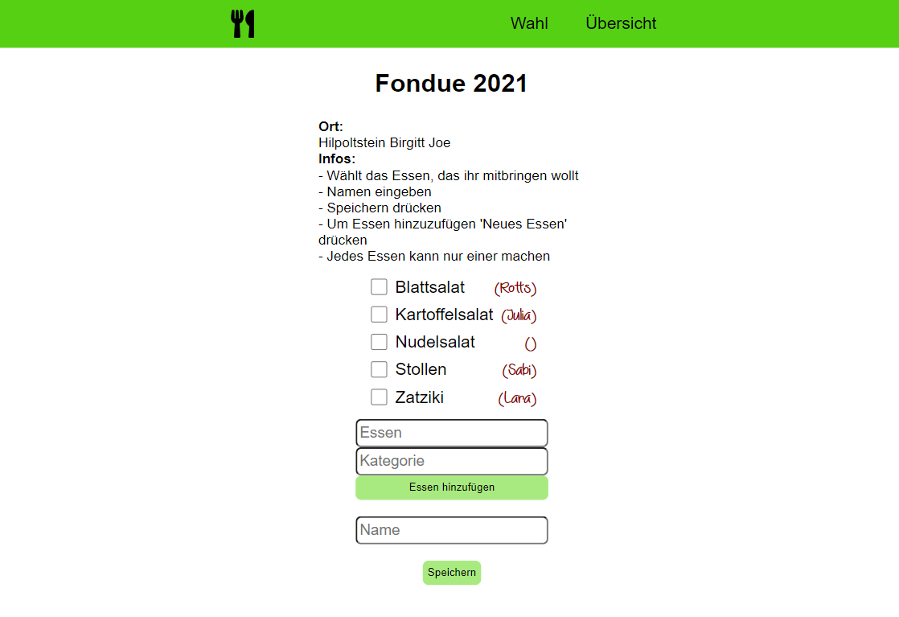
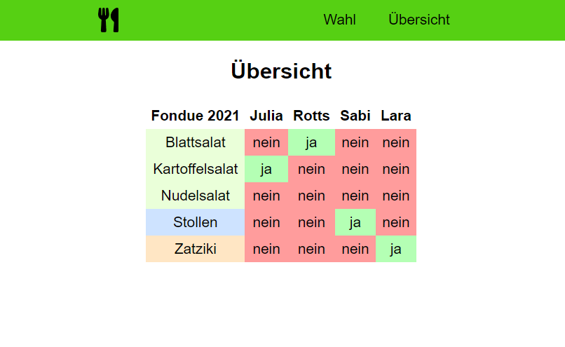
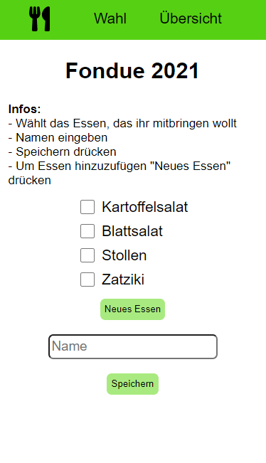

# Doodle-Picknick

Ein Doodle-Clon für die Organisation einer Mitbring-Party. Wer bringt was zum Essen mit?\
Test the App: https://www.bastian-harttung-projekte.de/Doodle-Picknick/index.html

### Übersicht

Eine, bei Übergröße, scrollbare Übersicht mit allen Namen und Essen, die vorhanden sind.

### - Handy kompatibel

#### Infos

Dies ist ein kleines privates Projekt in Javascript mit React um die Organisation von Picknicks und Fondue-Essen ohne
lästige Registrierung oder Werbung zu ermöglichen.\
Das Backend läuft direkt über den Server mit dem smallest_backend_ever von Junus Ergin.

